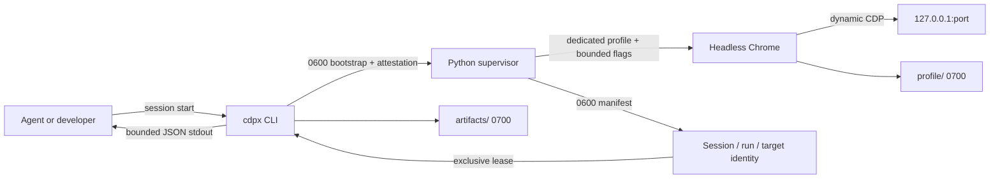
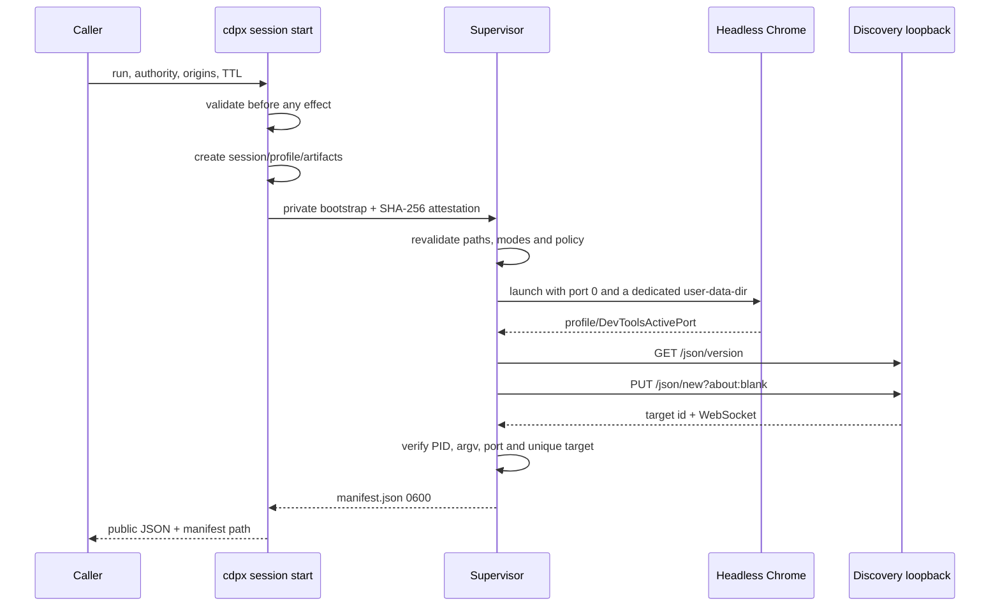
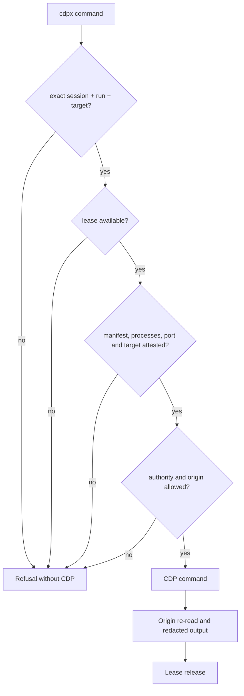
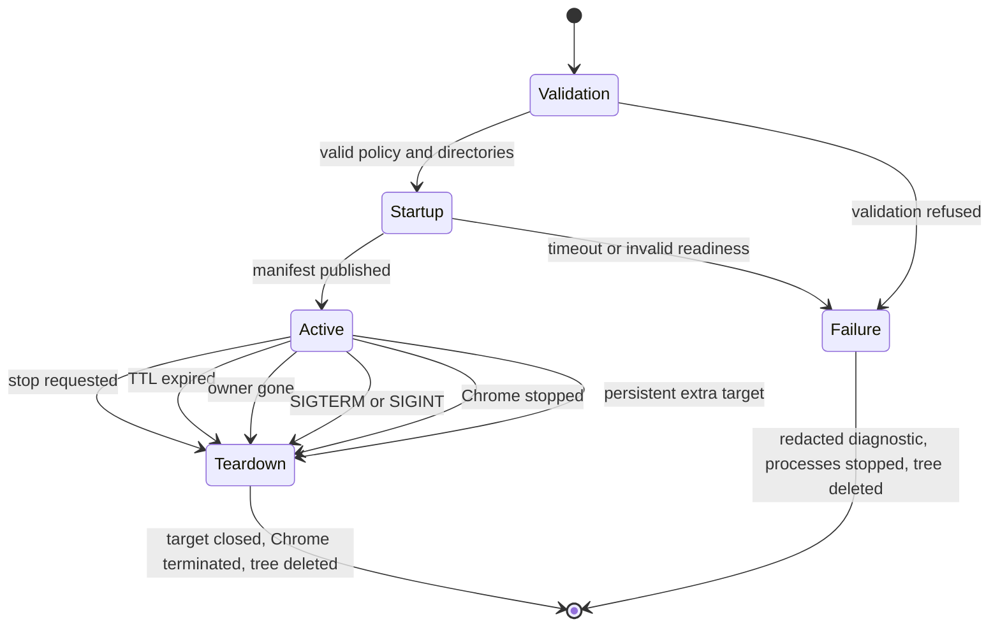

# Supervised sessions and Chrome processes

This reference describes the actual contract of `cdpx session`, from
binary selection to profile destruction. It is aimed at CLI users, the
people operating the runners and the supervisor's maintainers.

## Contract in one sentence

A session assigns a run a headless Chrome, a disposable profile, a
loopback CDP port and a single `page` target. The private manifest
ties these resources to an immutable authority, origin allowlist and
lifetime.



## Starting and using a session

```bash
cdpx session start \
  --run-id review-42 \
  --authority interaction \
  --origins "http://*.test,http://127.0.0.1:*" \
  --ttl 1800 \
  --startup-timeout 90
```

Startup returns, among other things, `manifest`, `run_id` and
`target_id`. These three values are mandatory for every browser
command. The simplest approach is `--export`, which replaces the
startup JSON with three quoted `export` lines to evaluate in the
current shell, `ssh-agent` style:

```bash
eval "$(cdpx session start --run-id review-42 --authority interaction \
  --origins "http://*.test,http://127.0.0.1:*" --ttl 1800 --export)"

cdpx goto http://demo.test/
cdpx session status
cdpx session stop
```

Without `--export`, the three values from the JSON output can be
passed explicitly to each command or exported by hand:

```bash
export CDPX_SESSION=/run/user/1000/cdpx/SESSION/manifest.json
export CDPX_RUN_ID=review-42
export CDPX_TARGET=TARGET_ID
```

Explicit arguments win over the environment. An empty value, a
different run or a different target is rejected before any CDP
command.

### Lifetime parameters

| Parameter | Default | Effect |
| --- | ---: | --- |
| `--ttl` | 3600 s | absolute expiration of the session and its profile |
| `--startup-timeout` | 60 s | shared cold-start budget, bounded to 300 s |
| global `--timeout` | 15 s | bounds CDP commands and the wait for `stop` |

The TTL starts before the supervisor is launched. The startup budget
covers the `DevToolsActivePort` file, the discovery endpoint, target
creation and its attestation. On failure, the tails of
`supervisor.log` and `chrome-stderr.log` are bounded, redacted,
returned on stderr, then the private directory is deleted.

## Chrome binary and command line

The runtime selects its bundled Chromium. Internal test harnesses may select
another binary, but the public CLI has no browser-path override. In source
internals cdpx looks for the first available executable in
`PATH`:

1. `chromium`;
2. `chromium-browser`;
3. `google-chrome`;
4. `google-chrome-stable`;
5. `chrome`.

An internal browser name resolves in `PATH`. A value containing a
separator is treated as a path, verified then made absolute. No
Chrome found is a startup error; cdpx never falls back to an
already-open personal session.

The browser process always receives:

```text
CHROME
  --headless=new
  --remote-debugging-address=127.0.0.1
  --remote-debugging-port=0
  --user-data-dir=SESSION/profile
  --no-first-run
  --no-default-browser-check
  --disable-gpu
  about:blank
```

`--no-sandbox` is added when cdpx runs as root or under `CI`.
`--disable-dev-shm-usage` is added under `CI` so that containers with
a small `/dev/shm` use the private on-disk profile. These options
must not be interpreted as permission to attach cdpx to a real
profile.

## Process tree

`session start` does not keep the calling CLI alive. It launches a
Python supervisor with `start_new_session=True`, waits for its
manifest or its error, then exits. The supervisor stays the owner of
Chrome until teardown.



The mock backend replaces Chrome with
`python -m cdpx.testing.mock_cdp`, but keeps the same profile, the
same dynamic port, the same manifest, the same identity triple and
the same teardown.

## Directories, profile and private files

The root is `$XDG_RUNTIME_DIR/cdpx` when available, otherwise
`/tmp/cdpx-UID`. Each session receives a random 24-character
hexadecimal identifier:

```text
RUNTIME_ROOT/
└── SESSION_ID/                 mode 0700
    ├── manifest.json           mode 0600, after readiness
    ├── supervisor.log          mode 0600
    ├── chrome-stderr.log       mode 0600
    ├── command.lock            mode 0600, created on the first lease
    ├── stop                    mode 0600, transient
    ├── profile/                mode 0700, --user-data-dir
    │   └── DevToolsActivePort  written by Chrome
    └── artifacts/              mode 0700
```

Before readiness, `bootstrap.json` exists as `0600`. It is deleted
right after the manifest is published. A `SESSION_ID.error` file may
exist transiently in the root to pass a supervisor error to the
parent; the parent reads it then deletes it.

The profile contains cookies, storage, caches and preferences for
this single Chrome. It is neither encrypted nor wiped bit by bit: its
confidentiality depends on Unix modes and its retention on the
deletion of the session tree.

## What is exposed

| Surface | Exposed data |
| --- | --- |
| `start` stdout | schema, session/run, ephemeral profile identifier, backend, authority, origins, host/port, target, timestamps and manifest path |
| `status` stdout | same public data, plus `browser_running` and `supervisor_running` |
| `stop` stdout | session, run and `stopped` confirmation |
| private manifest | WebSocket URL, PID and process startup identity, owner, session/profile/artifact paths |
| network endpoint | discovery and WebSocket only on `127.0.0.1:PORT` |
| browser content | untrusted data, always marked `_cdpx.content_trust: untrusted` |

The loopback port is not cryptographic authentication. A local
process able to scan the port can attempt to talk directly to Chrome.
The protection relies on the absence of remote network exposure, the
disposable profile, private permissions and the CLI's mandatory use
of the manifest. Do not launch untrusted navigation as root outside
an isolated environment.

## Lease and attestation before each command

A command loads the manifest while requiring the exact identity,
opens `command.lock` without following a symlink and attempts a
non-blocking exclusive `flock`. If another command holds the lease,
the second one fails immediately.

After acquisition, cdpx verifies:

- modes, ownership and confinement of the paths;
- TTL and any owner;
- PID, start time and argv markers of the supervisor and the
  browser;
- equality between `DevToolsActivePort` and the manifest's port;
- unique `page` target, exact identifier and WebSocket;
- required authority, declared destination and real origin
  before/after action.



The PID + start-time combination prevents mistaking a reused PID for
the assigned process. The argv markers, notably `--user-data-dir`,
prevent `stop` from killing an arbitrary process that merely shares
the same PID.

## Lifecycle and teardown



During the active state, the supervisor checks every 250 ms the stop
signal, the Chrome process, the `stop` file, the owner, the TTL and
the uniqueness of the target. A popup is closed; if it persists, the
session fails closed.

`session stop` also takes the lease, writes `stop`, then waits for
the directory to disappear. When its timeout expires, it only
terminates the PIDs after re-checking start-time and argv, then
deletes only the attested tree. The normal teardown closes the
target, sends TERM to Chrome, waits five seconds, then uses KILL if
needed.

SIGTERM and SIGINT of the supervisor go through this teardown.
SIGKILL, a machine failure or an abrupt power cut cannot run
`finally`: a runtime directory and, in rare cases, an orphaned Chrome
may remain. There is not yet a global purge daemon.

## Operations and diagnostics

Always start with the public interface:

```bash
cdpx session status \
  --session /run/user/1000/cdpx/SESSION/manifest.json \
  --run-id review-42 \
  --target TARGET_ID
```

| Symptom | Interpretation | Action |
| --- | --- | --- |
| Chrome/Chromium not found | bundled runtime is incomplete | reinstall the pinned image and report the digest |
| startup timeout | `DevToolsActivePort`, discovery or target not ready within the budget | read the redacted tails, increase up to 300 s at most, check sandbox and `/dev/shm` |
| manifest too open or symbolic | impaired private capability | fix the cause, do not bypass the check |
| session already in use | lease held by another command | let the command finish then retry |
| browser/supervisor `false` | non-compliant process snapshot | stop/recreate the session; do not reuse the manifest |
| expired session or missing owner | expected end of life | start a new session |
| persistent extra target | Chrome refuses to close a popup | consider the session compromised and recreate it |

`status` is a process snapshot, not a reservation: only a command
under lease performs the full attestation and keeps exclusivity until
it finishes.

After a machine crash, only delete a leftover directory after
verifying that no process still carries its `--user-data-dir` marker.
Target a specific session identifier; never arbitrarily delete
another user's entire runtime root.

## Validated guarantees and limits

The mock tests cover the emitted protocol, permissions, attestation,
reused PID, lease, startup errors, redaction and confinement. The
E2Es launch three simultaneous real Chromes and prove cookies/storage
isolation, the authority matrix, the unique target, explicit
teardown, TTL/owner and SIGTERM.

These guarantees do not make cdpx a sandbox for hostile content:

- the CDP port remains accessible to local processes;
- Chrome launched as root/CI uses `--no-sandbox`;
- the profile is deleted, not cryptographically wiped;
- an unhandled death can leave resources behind;
- the allowlist bounds cdpx, not every piece of software present on
  the machine.

The normative security contract remains described in
[HARNESS.md](../HARNESS.md), the CLI surface in
[PRIMITIVES.md](PRIMITIVES.md), and the proof scenarios in the
[Session state and controls sheet](features/state-session.md).
