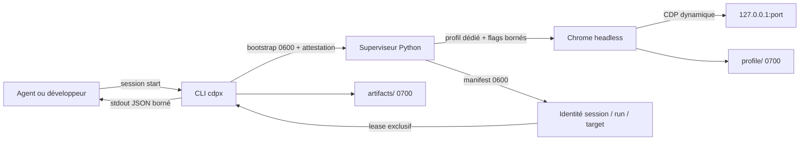
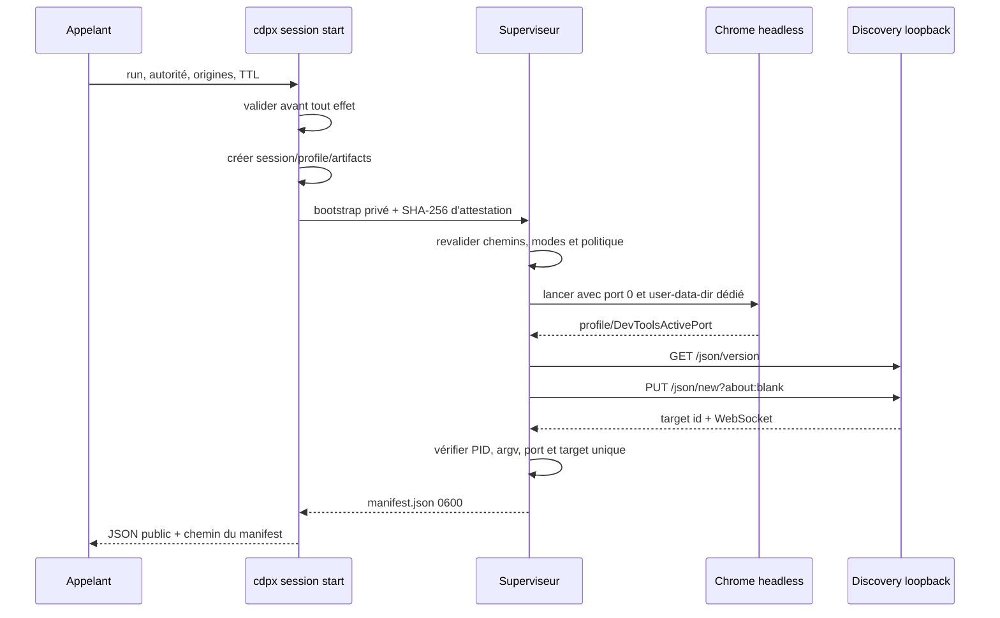
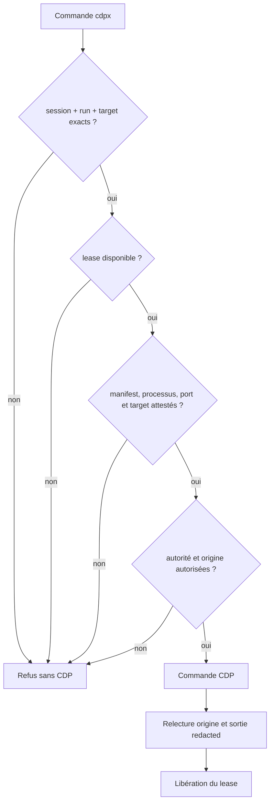
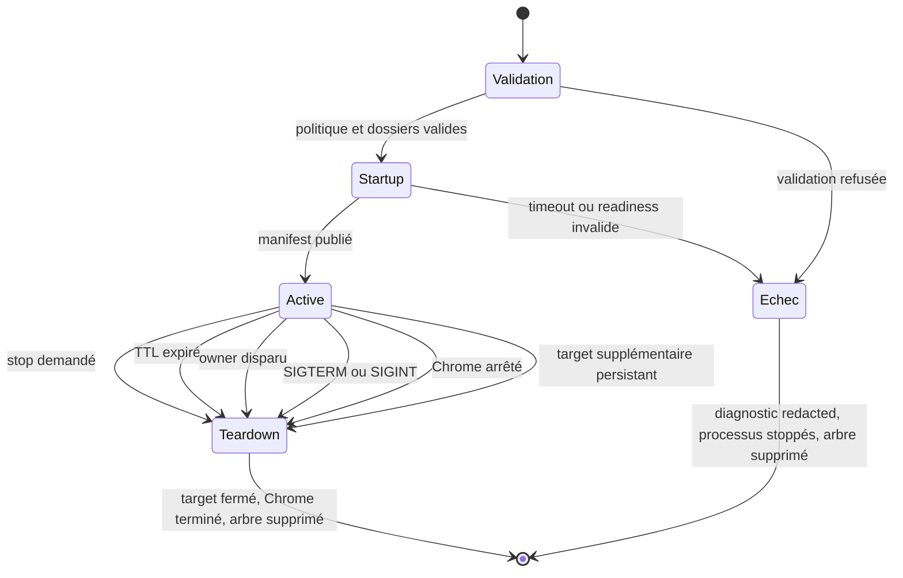

# Sessions supervisées et processus Chrome

Cette référence décrit le contrat réel de `cdpx session`, depuis la sélection
du binaire jusqu'à la destruction du profil. Elle s'adresse à la fois aux
utilisateurs du CLI, aux personnes qui exploitent les runners et aux
mainteneurs du superviseur.

## Contrat en une phrase

Une session attribue à un run un Chrome headless, un profil jetable, un port
CDP loopback et un unique target `page`. Le manifest privé relie ces ressources
à une autorité, une allowlist d'origines et une durée de vie immuables.



## Démarrer et utiliser une session

```bash
cdpx session start \
  --run-id review-42 \
  --authority interaction \
  --origins "http://*.test,http://127.0.0.1:*" \
  --ttl 1800 \
  --startup-timeout 90
```

Le démarrage retourne notamment `manifest`, `run_id` et `target_id`. Ces trois
valeurs sont obligatoires pour toute commande navigateur. Le plus simple est
`--export`, qui remplace le JSON de démarrage par trois lignes `export` quotées
à évaluer dans le shell courant, façon `ssh-agent` :

```bash
eval "$(cdpx session start --run-id review-42 --authority interaction \
  --origins "http://*.test,http://127.0.0.1:*" --ttl 1800 --export)"

cdpx goto http://demo.test/
cdpx session status
cdpx session stop
```

Sans `--export`, les trois valeurs de la sortie JSON peuvent être passées
explicitement à chaque commande ou exportées à la main :

```bash
export CDPX_SESSION=/run/user/1000/cdpx/SESSION/manifest.json
export CDPX_RUN_ID=review-42
export CDPX_TARGET=TARGET_ID
```

Les arguments explicites gagnent sur l'environnement. Une valeur vide, un run
différent ou un target différent est refusé avant toute commande CDP.

### Paramètres de durée de vie

| Paramètre | Défaut | Effet |
| --- | ---: | --- |
| `--ttl` | 3600 s | expiration absolue de la session et de son profil |
| `--startup-timeout` | 60 s | budget partagé du cold start, borné à 300 s |
| `--owner-pid` | absent | détruit la session lorsque ce processus disparaît |
| `--timeout` global | 15 s | borne les commandes CDP et l'attente de `stop` |

Le TTL commence avant le lancement du superviseur. Le budget de startup couvre
le fichier `DevToolsActivePort`, l'endpoint discovery, la création du target et
son attestation. En cas d'échec, les fins de `supervisor.log` et
`chrome-stderr.log` sont bornées, redacted, renvoyées sur stderr, puis le
dossier privé est supprimé.

## Binaire Chrome et ligne de commande

Sans `--chrome`, cdpx cherche le premier exécutable disponible dans le `PATH` :

1. `chromium` ;
2. `chromium-browser` ;
3. `google-chrome` ;
4. `google-chrome-stable` ;
5. `chrome`.

`--chrome NOM` résout le nom dans le `PATH`. Une valeur contenant un séparateur
est traitée comme un chemin, vérifiée puis rendue absolue. Aucun Chrome trouvé
est une erreur de démarrage ; cdpx ne se rabat jamais sur une session
personnelle déjà ouverte.

Le processus navigateur reçoit toujours :

```text
CHROME
  --headless=new
  --remote-debugging-address=127.0.0.1
  --remote-debugging-port=0
  --user-data-dir=SESSION/profile
  --no-first-run
  --no-default-browser-check
  --disable-gpu
  about:blank
```

`--no-sandbox` est ajouté lorsque cdpx tourne comme root ou sous `CI`.
`--disable-dev-shm-usage` est ajouté sous `CI` afin que les conteneurs à petit
`/dev/shm` utilisent le profil privé sur disque. Ces options ne doivent pas
être interprétées comme une permission d'attacher cdpx à un profil réel.

## Arbre des processus

`session start` ne garde pas le CLI appelant en vie. Il lance un superviseur
Python avec `start_new_session=True`, attend son manifest ou son erreur, puis
se termine. Le superviseur reste propriétaire du Chrome jusqu'au teardown.



Le backend mock remplace Chrome par
`python -m cdpx.testing.mock_cdp`, mais conserve le même profil, le même port
dynamique, le même manifest, la même identité triple et le même teardown.

## Dossiers, profil et fichiers privés

La racine vaut `$XDG_RUNTIME_DIR/cdpx` lorsqu'elle est disponible, sinon
`/tmp/cdpx-UID`. Chaque session reçoit un identifiant aléatoire de 24 caractères
hexadécimaux :

```text
RUNTIME_ROOT/
└── SESSION_ID/                 mode 0700
    ├── manifest.json           mode 0600, après readiness
    ├── supervisor.log          mode 0600
    ├── chrome-stderr.log       mode 0600
    ├── command.lock            mode 0600, créé au premier lease
    ├── stop                    mode 0600, transitoire
    ├── profile/                mode 0700, --user-data-dir
    │   └── DevToolsActivePort  écrit par Chrome
    └── artifacts/              mode 0700
```

Avant readiness, `bootstrap.json` existe en `0600`. Il est supprimé juste après
la publication du manifest. Un fichier `SESSION_ID.error` peut exister
transitoirement dans la racine pour transmettre une erreur du superviseur au
parent ; le parent le lit puis le supprime.

Le profil contient cookies, storage, caches et préférences de ce seul Chrome.
Il n'est ni chiffré ni effacé bit à bit : sa confidentialité dépend des modes
Unix et sa rétention de la suppression de l'arbre de session.

## Ce qui est exposé

| Surface | Données exposées |
| --- | --- |
| stdout de `start` | schéma, session/run, identifiant de profil éphémère, backend, autorité, origines, hôte/port, target, timestamps et chemin du manifest |
| stdout de `status` | mêmes données publiques, plus `browser_running` et `supervisor_running` |
| stdout de `stop` | session, run et confirmation `stopped` |
| manifest privé | URL WebSocket, PID et identité de démarrage des processus, owner, chemins session/profil/artefacts |
| endpoint réseau | discovery et WebSocket uniquement sur `127.0.0.1:PORT` |
| contenu navigateur | données non fiables, toujours marquées `_cdpx.content_trust: untrusted` |

Le port loopback n'est pas une authentification cryptographique. Un processus
local capable de scanner le port peut tenter de parler directement à Chrome.
La protection repose sur l'absence d'exposition réseau distante, le profil
jetable, les permissions privées et l'usage obligatoire du manifest par le
CLI. Ne lancez pas de navigation non fiable comme root en dehors d'un
environnement isolé.

## Lease et attestation avant chaque commande

Une commande charge le manifest en exigeant l'identité exacte, ouvre
`command.lock` sans suivre de symlink et tente un `flock` exclusif non bloquant.
Si une autre commande possède le lease, la seconde échoue immédiatement.

Après acquisition, cdpx vérifie :

- modes, propriétaire et confinement des chemins ;
- TTL et owner éventuel ;
- PID, instant de démarrage et marqueurs argv du superviseur et du navigateur ;
- égalité entre `DevToolsActivePort` et le port du manifest ;
- unique target `page`, identifiant et WebSocket exacts ;
- autorité requise, destination déclarée et origine réelle avant/après action.



La combinaison PID + instant de démarrage empêche de confondre un PID réutilisé
avec le processus attribué. Les marqueurs argv, notamment `--user-data-dir`,
empêchent `stop` de tuer un processus arbitraire portant seulement le même PID.

## Cycle de vie et teardown



Pendant l'état actif, le superviseur contrôle toutes les 250 ms le signal
d'arrêt, le processus Chrome, le fichier `stop`, l'owner, le TTL et l'unicité du
target. Un popup est fermé ; s'il persiste, la session échoue fermée.

`session stop` prend lui aussi le lease, écrit `stop`, puis attend la disparition
du dossier. À expiration de son timeout, il ne termine les PID qu'après avoir
revérifié start-time et argv, puis supprime uniquement l'arbre attesté. Le
teardown normal ferme le target, envoie TERM à Chrome, attend cinq secondes,
puis utilise KILL si nécessaire.

SIGTERM et SIGINT du superviseur passent par ce teardown. SIGKILL, panne machine
ou coupure brutale ne peuvent pas exécuter `finally` : un dossier runtime et,
exceptionnellement, un Chrome orphelin peuvent rester. Il n'existe pas encore de
daemon global de purge.

## Exploitation et diagnostic

Commencez toujours par l'interface publique :

```bash
cdpx session status \
  --session /run/user/1000/cdpx/SESSION/manifest.json \
  --run-id review-42 \
  --target TARGET_ID
```

| Symptôme | Interprétation | Action |
| --- | --- | --- |
| Chrome/Chromium introuvable | aucun candidat et aucun `--chrome` valide | installer Chrome ou fournir un chemin explicite |
| timeout de démarrage | `DevToolsActivePort`, discovery ou target non prêt dans le budget | lire les tails redacted, augmenter au plus à 300 s, vérifier sandbox et `/dev/shm` |
| manifest trop ouvert ou symbolique | capacité privée altérée | corriger la cause, ne pas contourner le contrôle |
| session déjà utilisée | lease détenu par une autre commande | laisser finir la commande puis réessayer |
| browser/supervisor `false` | snapshot de processus non conforme | arrêter/recréer la session ; ne pas réutiliser le manifest |
| session expirée ou owner absent | fin de vie attendue | démarrer une nouvelle session |
| target supplémentaire persistant | Chrome refuse de fermer un popup | considérer la session compromise et la recréer |

`status` est un snapshot de processus, pas une réservation : seule une commande
sous lease effectue l'attestation complète et garde l'exclusivité jusqu'à sa
fin.

Après un crash machine, ne supprimez un dossier résiduel qu'après avoir vérifié
qu'aucun processus ne porte encore son marqueur `--user-data-dir`. Ciblez un
identifiant de session précis ; ne supprimez jamais arbitrairement toute la
racine runtime d'un autre utilisateur.

## Garanties validées et limites

Les tests mock couvrent protocole émis, permissions, attestation, PID réutilisé,
lease, erreurs de startup, redaction et confinement. Les E2E lancent trois
Chrome réels simultanés et prouvent l'isolation cookies/storage, la matrice
d'autorités, le target unique, le teardown explicite, TTL/owner et SIGTERM.

Ces garanties ne font pas de cdpx un bac à sable pour contenu hostile :

- le port CDP reste accessible aux processus locaux ;
- Chrome lancé root/CI utilise `--no-sandbox` ;
- le profil est supprimé, pas effacé cryptographiquement ;
- une mort non gérée peut laisser des ressources ;
- l'allowlist borne cdpx, pas tous les logiciels présents sur la machine.

Le contrat normatif de sécurité reste décrit dans [HARNESS.md](../HARNESS.md),
la surface CLI dans [PRIMITIVES.md](PRIMITIVES.md), et les scénarios de preuve
dans la [fiche État et contrôles de session](features/state-session.md).
